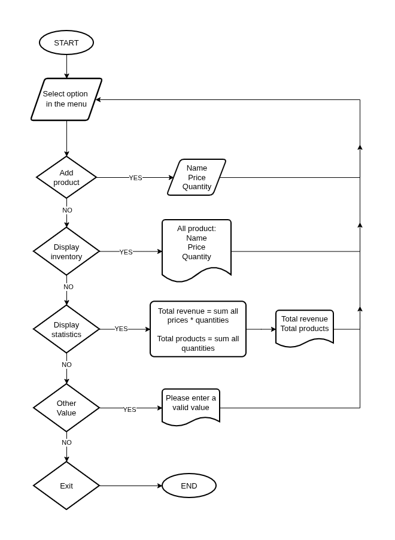

## J-PRODUCT SUPERMARKET INVENTORY SYSTEM

### ✅ Description

This project implements a simple Inventory Management System for a supermarket called J-Product Supermarket.

It allows users to add products, display the current inventory, and generate basic statistics such as total revenue and total number of products.

The system is a console-based application, designed to work directly in the terminal without using external databases or files.

### ✅ Flow diagram

### ✅ System architecture

The system follows a modular structure, where each Python file has a specific responsibility:

+ main.py: Entry point of the program. Displays the welcome message and calls the interactive menu.

+ interactive_menu.py: Displays menu options and manages user interaction. It connects all system functionalities.

+ add_product.py: Handles the creation of new products, including input validation for name, price, and quantity.

+ display_inventory.py: Shows all products stored in the inventory in a formatted way.

+ display_statistics.py: Calculates total revenue and total number of products in the inventory.

### ✅ Instructions for running the program

1. Make sure you have Python 3 installed on your computer.
   
2. Download or clone all the project files into a single folder.
   
3. Open a terminal and navigate to the project directory.
   
4. Run the program with the following command:
   
        python main.py

5. Use the menu options by entering the corresponding number:

        1: Add product  
        2: Display inventory  
        3: Display statistics  
        4: Exit  

### ✅ Data structures used

The inventory is stored as a list where each element represents a product. The product information will be saved as a dictionary with the keys "name", "price" and "quantity".

The program will run with an empty inventory and the user will add the product information, it will be stored, for example, as:

    inventory = [
        {"name": "Apple", "price": 2.5, "quantity": 10},
        {"name": "Milk", "price": 3.0, "quantity": 5}
    ]

### ✅ Description of the implement modules

**add_product.py:**

+ Requests product name, price, and quantity from the user.
+ Validates inputs to ensure correct data types and values.
+ Creates a dictionary for the new product.
Adds the product to the inventory list.

**display_inventory.py:**

+ Iterates through all products in the inventory.
+ Displays each product with its name, price, and quantity.
+ Formats the output for better readability.

**display_statistics.py:**

+ Calculates total revenue using:
(price × quantity for each product)
+ Calculates total number of products (sum of quantities).
+ Returns both values for display.

**interactive_menu.py:**

+ Displays an interactive menu with options.
+ Handles user input and validates options.
+ Calls the corresponding functions based on user selection.
+ Keeps the program running until the user chooses to exit.

**main.py:**

+ Initializes the inventory as an empty list.
+ Displays a welcome message.
+ Calls the menu function to start the program.

